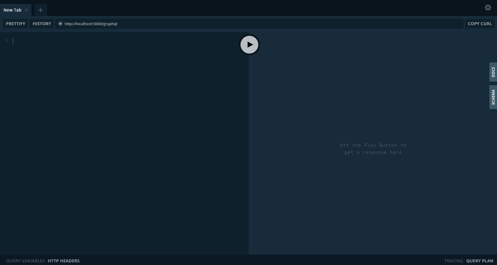
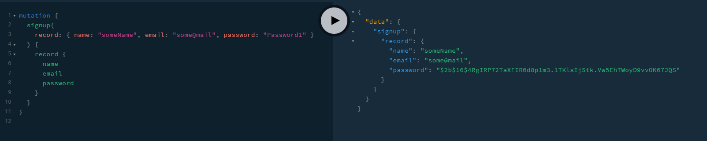
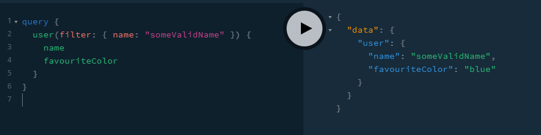
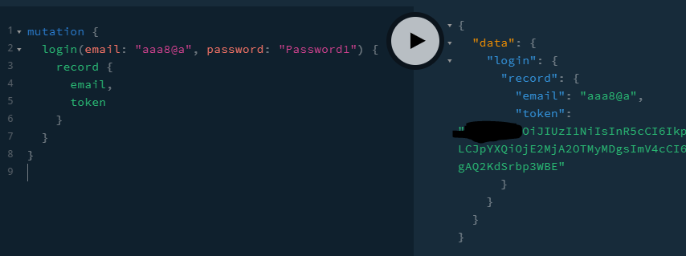
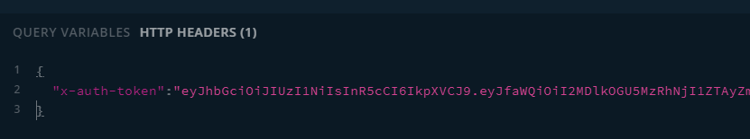

# Apollo Playground

This doc helps you get started with the use of GraphQL queries and mutations and how to use them in Apollo Playground

## Start

Get our server running first:

```bash
nodemon server
```

now, head over to our graphql endpoint: http://localhost:5000/graphql

We should see the Apollo Playground now: 

## Signup

To get started, we create a user.

### Resolvers

Upon sending the query, a resolver on the backend first looks if the record follows the business policies (a username
has a minlength and maxlength, an email is valid, the password contains lower/uppercase etc.).  
If the checks passed, we use bcrypt to generate a hashed and salted password.  
We save that new user to the db.

### The Mutation

We use this mutation to create the user

```graphql
mutation {
  userCreateOne(record: { name: "someValidName", email: "someValid@mail", password: "Password1" }) {
    record {
      name
      email
      password
    }
  }
}
```


*The user in the example already exists, so you need to come up with a new name/email*

## User Query

We can use this query to see the public UserTC (TypeComposer) that only contains fields we are happy to share to the
public. For now, the public fields are: name and favouriteColor.

```graphql
query {
  user(filter: { name: "someValidName" }) {
    name
    favouriteColor
  }
}
```



## Authorization

Some queries require a user to be logged in (or in the future a user to have the admin role). We use JWT for
authorization.

### login

To generate a JWT, use this query to log yourself in:

```graphql
mutation {
  login(email: "some@email", password: "yourPassword") {
    record {
      email,
      token
    }
  }
}
```



### use the JWT

An example query that requires authorization exposes all fields to us. To not leak our entire database to the public, we
want to only allow specific users to use this query.  
Currently, we only require the user to be authorized and not to be an admin - but the point stands.

unlike the arguments we can set in the query, the JWT belongs in the context. Set it as an HTTP header:


```json
{
  "x-auth-token": "your token"
}
```

We can use the admin query to request all fields of the user - for example his email.

```graphql
query {
  userAdmin(filter: { name: "Max Mustermann" }) {
    name
    email
  }
}
```

